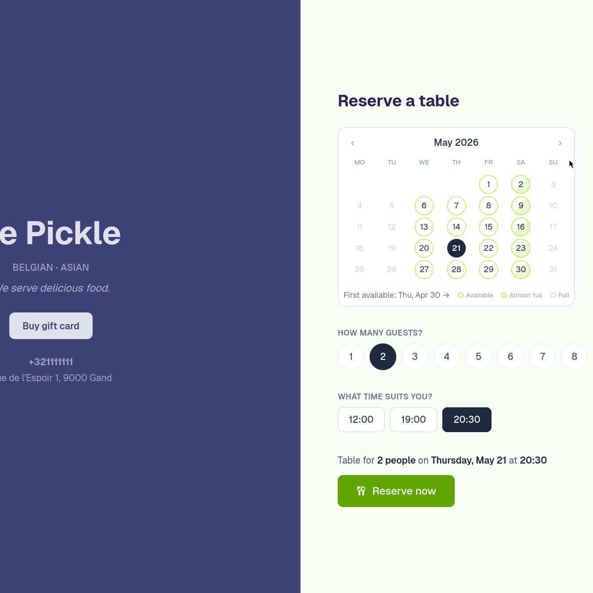
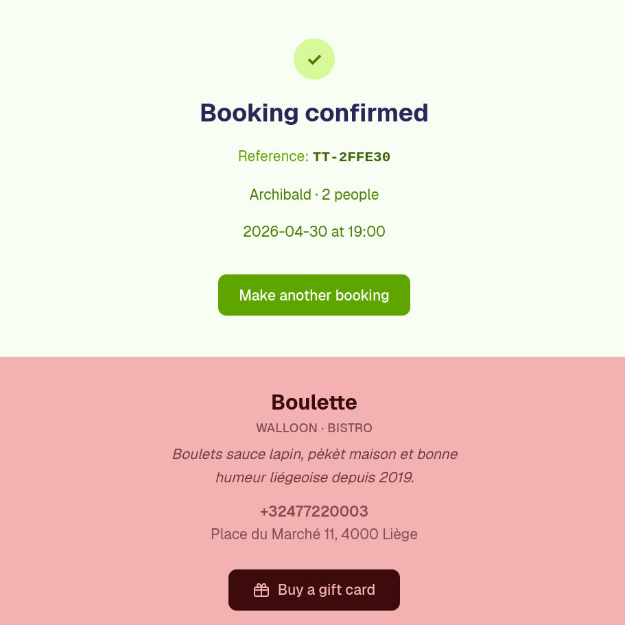
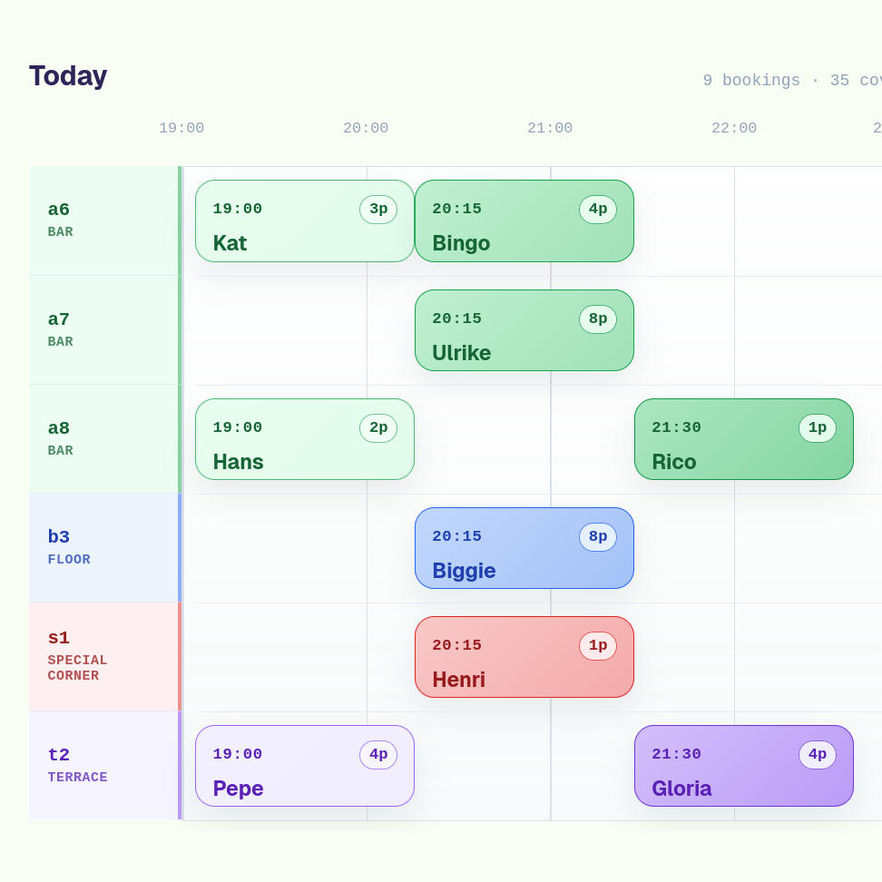
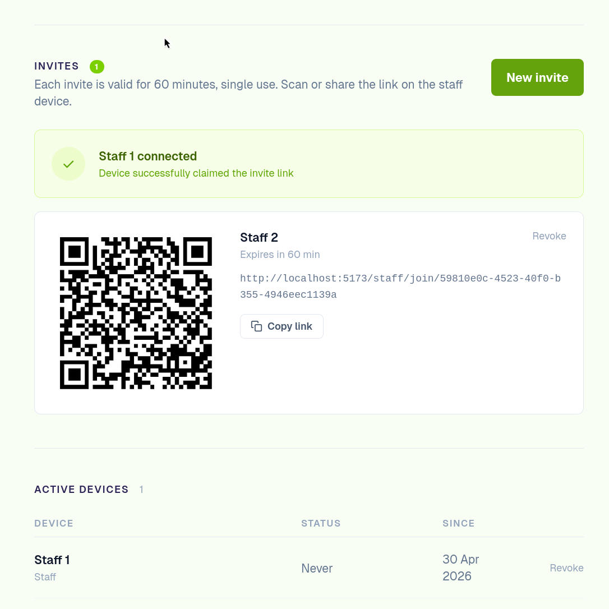
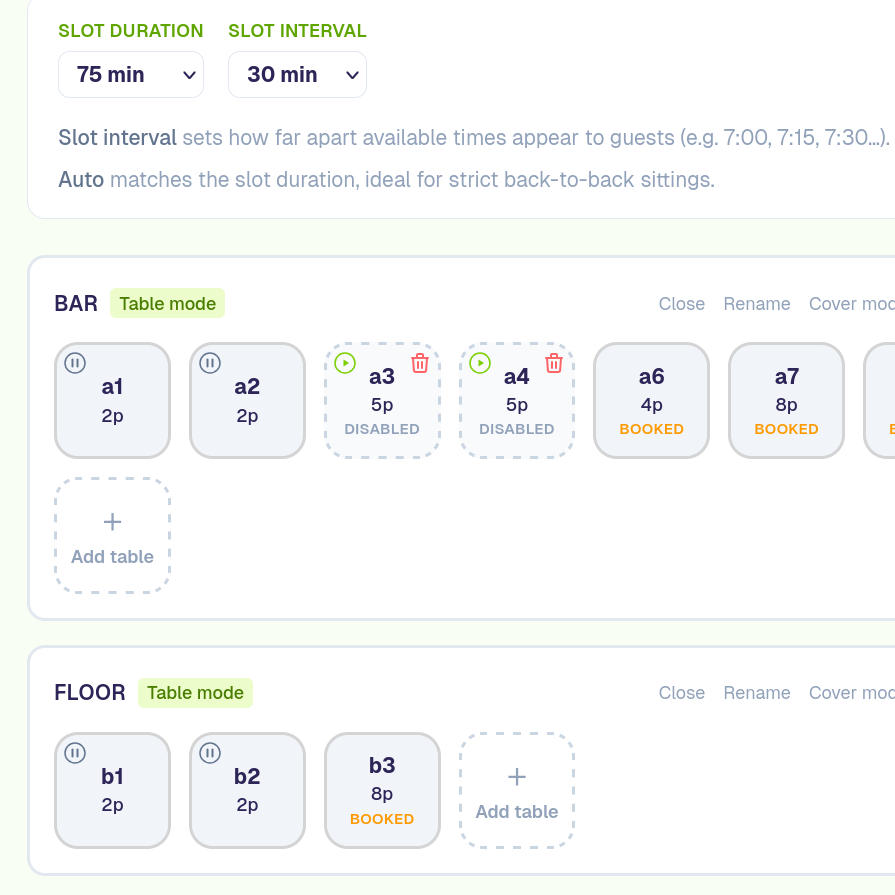

+++
title = "tabletango"
date = 2026-04-20

[extra]
thumbnail = "fig_01.jpg"
+++

I built this project to explore further full stack development. A lot is new territory: Axum for routing, async Rust, reactive frontends, SSR vs CSR, infrastructure-as-code. Running NixOS as daily driver helped greatly for declarative deployment.

This is a platform to help restaurants to manage reservations. The project includes a live dashboard with reservations, configurable customer booking pages, table and schedule management, gift cards, device pairing via QR code.

<input class="sg-r" type="radio" name="sg" id="r1" checked>
<input class="sg-r" type="radio" name="sg" id="r2">
<input class="sg-r" type="radio" name="sg" id="r3">
<input class="sg-r" type="radio" name="sg" id="r4">
<input class="sg-r" type="radio" name="sg" id="r5">

  

    

      
      <label class="slide-arr l" for="r5">&larr;</label>
      <label class="slide-arr r" for="r2">&rarr;</label>
    

    
1 / 5

  

  

    

      
      <label class="slide-arr l" for="r1">&larr;</label>
      <label class="slide-arr r" for="r3">&rarr;</label>
    

    
2 / 5

  

  

    

      
      <label class="slide-arr l" for="r2">&larr;</label>
      <label class="slide-arr r" for="r4">&rarr;</label>
    

    
3 / 5

  

  

    

      
      <label class="slide-arr l" for="r3">&larr;</label>
      <label class="slide-arr r" for="r5">&rarr;</label>
    

    
4 / 5

  

  

    

      
      <label class="slide-arr l" for="r4">&larr;</label>
      <label class="slide-arr r" for="r1">&rarr;</label>
    

    
5 / 5

  

**Backend in Rust**

- [Axum](https://github.com/tokio-rs/axum) for routing, REST API with token-based auth
- [SQLx](https://github.com/launchbadge/sqlx) with compile-time verified SQL queries against PostgreSQL
- [Tokio](https://tokio.rs) broadcast channels for real-time dashboard events

**Frontend with SvelteKit**

- Svelte 5 (Runes)
- TypeScript
- Tailwind CSS

**Infrastructure**

- PostgreSQL in Docker locally, NixOS service in production
- Hetzner VPS reformatted to NixOS with [nixos-anywhere](https://github.com/nix-community/nixos-anywhere)
- [Caddy](https://caddyserver.com) as reverse proxy with automatic HTTPS
- Rust binary built reproducibly with [Crane](https://github.com/ipetkov/crane) + Nix flakes
- Remote deployments over ssh with [deploy-rs](https://github.com/serokell/deploy-rs)

**Llm collegue**
- Claude used throughout development and NixOS config for deployment.

**Todo**
- Secret management with [sops-nix](https://github.com/Mic92/sops-nix)
